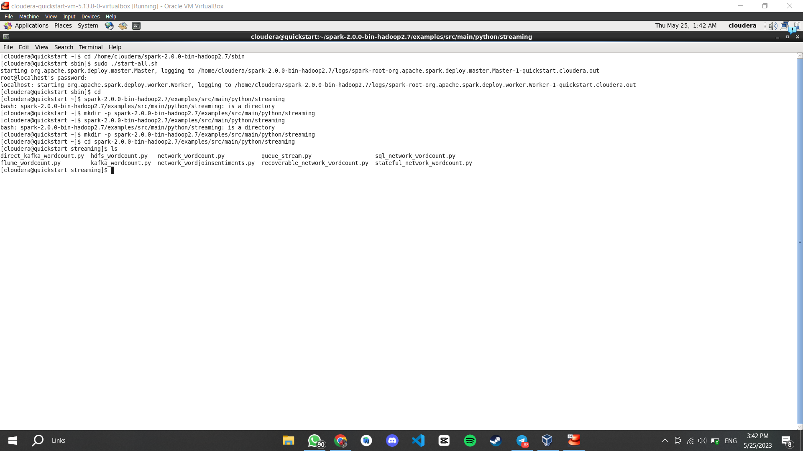
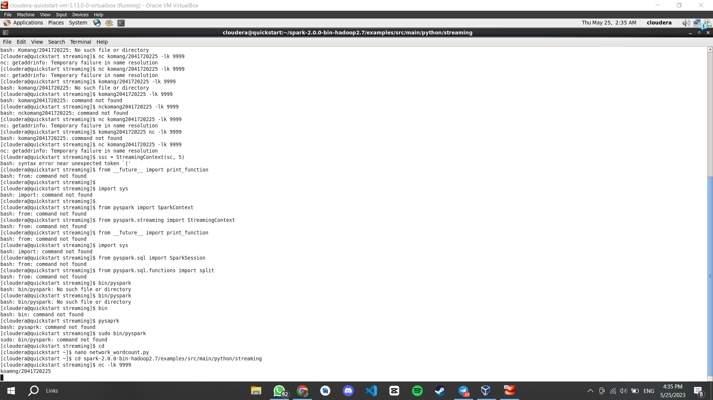
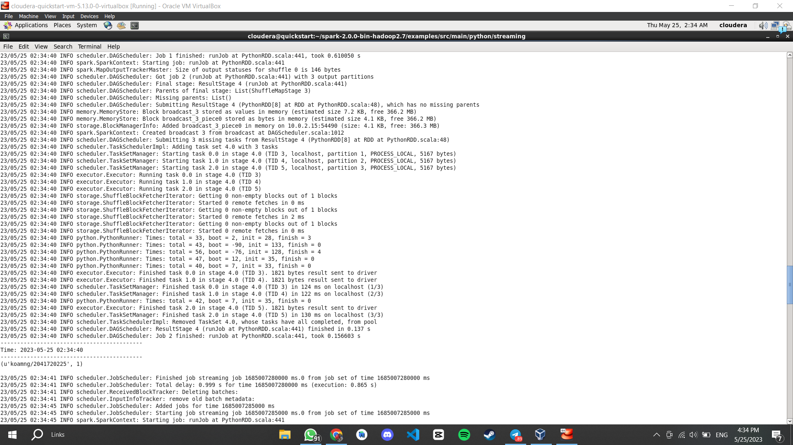
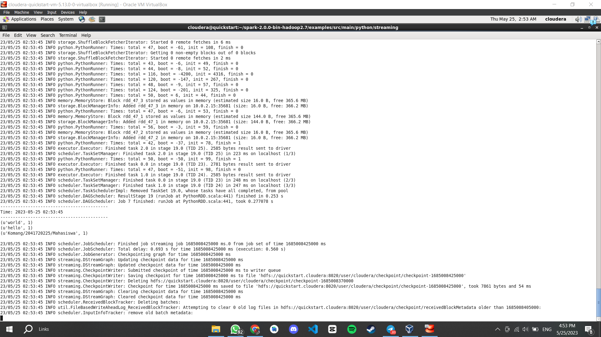
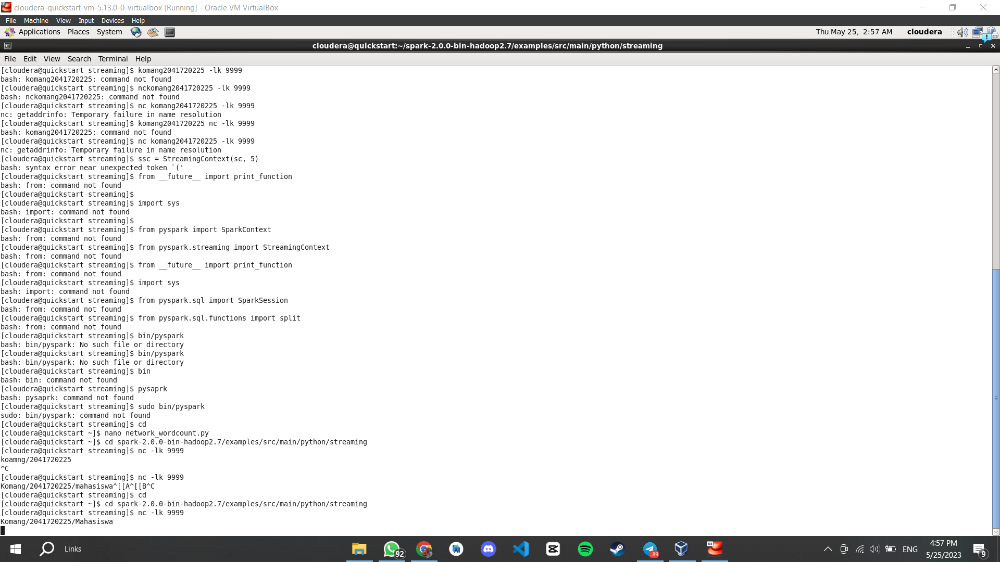
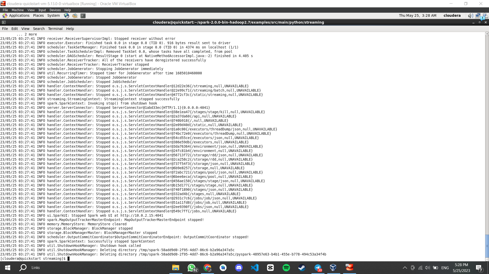

1.  Silakan selesaikan praktikum tersebut sesuai langkah-langkah sebelumnya, lalu laporkan hasilnya berupa link repository GitHub dengan nama spark-streaming disertai dengan screenshot hasilnya.
2.  Jelaskan perbedaan spark streaming dengan metode stateless dan stateful stream processing ?
    -   Stateless stream processing adalah pendekatan pemrosesan data aliran di mana setiap batch
        data yang masuk dianggap sebagai entitas terpisah dan tidak ada informasi yang disimpan tentang batch sebelumnya.
    -   Stateful stream processing adalah pendekatan pemrosesan data aliran di mana status
        (state) dipertahankan dan digunakan dalam pemrosesan data di batch berikutnya. 
3.  Jelaskan masing-masing maksud kode berikut sesuai nomor kodenya pada laporan praktikum Anda!

4.  Penjelasan kode:

    sys.argv: Ini adalah sebuah list yang berisi argumen baris perintah yang diberikan saat menjalankan program Python. Dalam kode ini, kita menggunakan sys.argv untuk mengambil argumen <hostname> dan <port>.
    sys.stderr: Ini adalah objek yang mewakili aliran kesalahan standar.
    StreamingContext: Ini adalah kelas utama dalam modul pyspark.streaming yang digunakan untuk membuat konteks streaming Spark.
    sc: Ini adalah objek SparkContext yang digunakan untuk menginisialisasi konteks Spark.
    socketTextStream: Ini adalah metode pada objek StreamingContext yang digunakan untuk membuat DStream dari streaming data yang diterima melalui socket.
    reduceByKey: Ini adalah metode pada DStream yang digunakan untuk menggabungkan nilai-nilai yang sesuai dengan kunci dengan menggunakan fungsi yang diberikan.
    lambda line: Ini adalah ekspresi lambda yang digunakan untuk memisahkan baris menjadi kata-kata menggunakan spasi sebagai pemisah.
    awaitTermination: Ini adalah metode pada objek StreamingContext yang digunakan untuk memulai pemrosesan streaming dan menunggu hingga pemrosesan dihentikan.

5.  nc: Merujuk pada nc (netcat), yaitu utilitas baris perintah yang digunakan untuk membuat    
    lk: Tidak ada informasi yang cukup untuk memberikan penjelasan yang jelas. Perlu lebih banyak konteks atau informasi untuk memahami arti dari lk dalam kode tersebut.

6.  spark-submit: Ini adalah perintah baris perintah yang digunakan untuk mengirimkan aplikasi
    Spark ke cluster atau menjalankannya secara lokal.
    master: Ini adalah argumen yang digunakan dengan spark-submit untuk menentukan lokasi master Spark. Nilai ini dapat berupa URL master Spark, seperti local[*], spark://host:port, atau yarn.
    local[*]: Ini adalah mode lokal yang digunakan dalam pengembangan dan pengujian, di mana semua CPU yang tersedia akan digunakan.

7.  ssc.checkpoint: Metode ini digunakan untuk mengatur titik kontrol (checkpoint) untuk    
    parallelize: Metode ini digunakan untuk membuat RDD (Resilient Distributed Dataset) dari koleksi yang ada di driver program.
    updateStateByKey: Metode ini digunakan pada DStream untuk menghitung status (state) streaming dengan menggunakan fungsi yang diberikan.
    flatMap: Metode ini digunakan pada DStream untuk menghasilkan satu atau lebih elemen output untuk setiap elemen input dengan menggunakan fungsi yang diberikan.

8.  rdd.take(5): Metode take() digunakan pada RDD (Resilient Distributed Dataset) untuk
    mengambil   
    transform: Metode transform() digunakan pada DStream (Distributed Stream) untuk menghasilkan DStream baru dengan menerapkan transformasi pada setiap batch dari DStream yang ada. Transformasi yang diberikan dapat berupa fungsi atau ekspresi lambda.
    rdd.sortByKey(False): Metode sortByKey() digunakan pada RDD untuk mengurutkan elemen berdasarkan kunci (key) dalam urutan menaik atau menurun. Dalam contoh ini, rdd.sortByKey(False) akan mengurutkan RDD berdasarkan kunci dalam urutan menurun (descending order), di mana False menandakan urutan menurun.

# Hasil Praktikum

# Cek File

# network_wordcount

# stateful_network_wordcount

# network_wordjoinsentiments

##### Komang Gede Narariya Suputra

##### 2041720225

##### TI3B

##### 10
